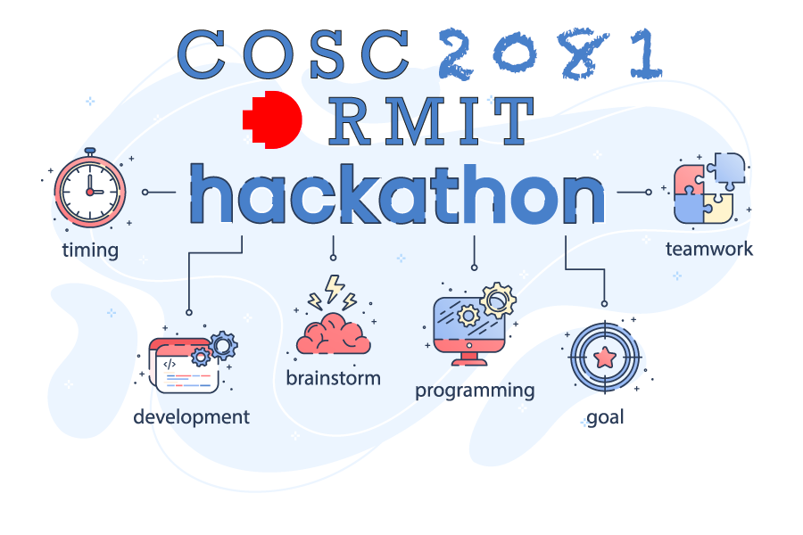

# COSC2081 Programming I - Assignment

***

RMIT University Vietnam - Semester 2022C - COSC2081 Programming 1 - Assignment 3

Prepare students to work in software development projects that use Java and Object-Oriented Programming

Lecturer: [Tom Huynh](https://github.com/TomHuynhSG) ( tom.huynh@rmit.edu.vn )

GitHub Repo : https://github.com/yoantran/order-management-system

Video Demonstration Link:

### HTML group, including:

| Name                 | sID      | Email                | Github                      |
|----------------------|----------|----------------------|-----------------------------|
| Nguyen Nhat Minh     | S3932112 | S3932112@rmit.edu.vn |                             |
| Luu Quoc Nhat        | S3924942 | S3924942@rmit.edu.vn |                             |
| Tran Ngoc Hong Doanh | s3927023 | s3927023@rmit.edu.vn | https://github.com/yoantran |
| To Gia Hy            | S3927539 | S3927539@rmit.edu.vn |                             |

***
## Assessment Details

In Australian universities, one of the best ways for students to get real coding experience is to join a
team-project-based hackathon hosted by tech companies to solve problems they deeply care about.

The name comes from “hack” and “marathon”, which should give you a good idea of the meaning of this word. Thus, a
hackathon is a coding event that aim to create, innovate, improve and develop a software solution as an attempt to
resolve an existing problem in society.

Thus, the nature of this assignment 3 is to provide you a taste and experience of a 4-week tech hackathon.

Assume that you are involved in a technology store that wishes to develop an Order Management System, which is the key
point of their business growth plan. This may reduce the paper and printing and distribution work which saves a lot of
time.

The main objective of the Store Order Management System is to allow customers order products.

The detailed requirements and technical specifications for this application can be found: [here](COSC2081_Group_Project.pdf)

Sample database text files can be found :

[customer text file](customers.txt)

[item text file](items.txt)

